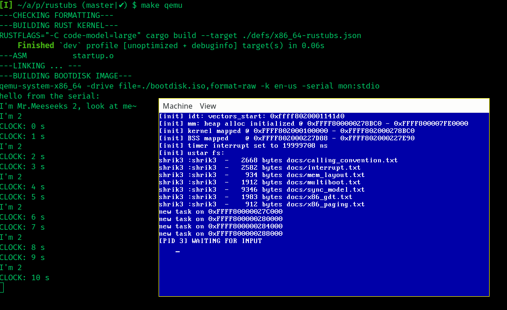

[](https://builds.sr.ht/~shrik3/rustubs/commits/master/x86_64.yml?)

* [Roadmap](#roadmap)
* [Build](#build)
* [Structure](#structure)
* [Contributing](#contributing)
* [License & Copyright](#license-amp-copyright)
* [Remarks](#remarks)
* [Documentation Sources](#documentation-sources)

# RuStuBS: a rust tutorial operating system inspired by OOStuBS.



**Disclaimer**
Despite the name, this project has **absolutely nothing to do** with rstubs (Uni
Hannover) or RuStuBS (FAU). See [Remarks](#remarks)

**RuStuBS documentations**
- [code documentations](https://rustubs.shrik3.com/rustubs/index.html).
- [basic concepts](https://git.sr.ht/~shrik3/rustubs/tree/master/item/docs).
   Most importantly, the [Synchronization model](https://git.sr.ht/~shrik3/rustubs/tree/master/item/docs/sync_model.md)

This is a toy bare metal operation system implemented in Rust. Apologies for my
shitty code, I'm a rust beginner.

## Roadmap
`[X]` means complete, `[?]` means half-baked

**in the name of OOStuBS**
- [X] GDB support (qemu stub)
- [X] synchronized CGA display
- [X] rust `println!` integration
- [X] Interrupt handler
- [X] **interrupt sync (pro-/epilogue model)**
- [X] Keyboard controller and semaphore input handler
- [X] multi-threading
- [X] Scheduler (single CPU)
    - [X] synchronized scheduling
    - [X] waiting tasks
- [X] Timer Interrupt and preemptive scheduling
- [X] **Synchronization Primitives**
    - [X] level3 (prologue) and level2 (epilogue) Synchronization
    - [X] semaphore (spinning and sleeping variants)
- [X] wall clock and sleep (w. cooperative scheduling)

**Beyond StuBS**
- [X] kernel heap management (using the [linked-list-allocator ](https://github.com/rust-osdev/linked-list-allocator))
    TODO: implement my own
- [X] higher half Kernel
- [?] Task Descriptor structures
- [?] more control over hardware
    - [X] serial output
    - [X] custom IDT
    - [X] multiboot info
- [X] in memory FS
    - [X] ustar FS, read-only & statically linked
- [X] parse and load user elf
- [?] full-fledged Paging and virtual memory
    - [X] mapping for kernel heap and kernel code (higher half mem)
    - [?] pagefault handler
    - [?] Address Space for each Process + virtual memory management
- [ ] user heap and mmap
- [ ] user library
- [ ] syscall

**MISC**
- [?] VGA graphic mode
- [ ] FP and SSE state
- [ ] multicore (MPStuBS)
- [ ] aarch64 support

## Build

Please take a look at the CI manifest:
`.builds/x86_64.yml`

**build dependencies**
- newest rust nightly toolchain: `nightly-x86_64-unknown-linux-gnu`. `1.80
  nightly (2024-06-04) ` is tested.
- `rustfmt`, this should be shipped with your rust/cargo installation. If not,
  install with
    ```
    $ cargo install rustfmt
    ```
- `GNU ld (GNU Binutils)`
- `nasm` for the assembly sources
- `xorriso` and `grub` to create bootdisk image.
- `Gnu Make`


**Add rust sources**
- We use `no_std` in the rust build. To use the `core` components, you need to
  add the rust sources by running e.g. `rustup component add  rust-src`
  , optionally specify the toolchain here, if the aforementioned nightly is not
  made default

**build and run**
- simply run `make`, you will get `bootdisk.iso`, which you can use to boot a
  bare metal
- use `make qemu` to load and test the iso image with qemu (need
  `qemu-system-x86_64`)

**debug with gdb**
- require `gdb` (or `rust-gdb`)
- make sure you have the debug build (default)
- run `make qemu-gdb` in one terminal and `make gdb` in another.

**troubleshooting**
- `ld (Gnu Binutils) <=2.39` do not support `--no-warn-rwx-segments` flag. If
  that's your case, remove it from the `LDFLAGS` in `Makefile`
- `grub-mkrescue` fails if you don't have the `piglatin` locale available.
  Either pick one locale you have, or remove the `--locale` option for
  `grub-mkrescue` in `Makefile`. (If you don't specify one locale, all will be
  installed, resulting in a unnecessarily huge image).

## Structure

```
.
├── boot            # early boot/startup code
├── defs            # specs for target arch, linking and compiler
├── docs            # namely
├── isofiles        # assets for the grub generated iso
├── src             # main source code
├── .build          # CI manifests (for builds.sr.ht)
├── .cargo          # config for cargo build (build-std)

```

## Contributing

NOTE: before submitting code, check linter and code format by running
`make check`, or add this to your git pre-commit hook e.g.
```sh
if ! make check; then
    echo "ERROR: linter or formatting error. Make sure your code passes rustfmt and clippy"
    exit 1
fi
```

Anyone can contribute to rustubs. Please refer to
[the contribution guidelines](https://git.sr.ht/~shrik3/rustubs/tree/master/item/CONTRIBUTING.md)

## License & Copyright

This project is licensed under **EUPL 1.2.**. See `LICENSE` and `ATTRIBUTIONS`.

**Notes on OOStuBS**
The OOStuBS, which this project takes inspirations from, doesn't allow
re-distribution without written consent from its copyright holders. This project
contains some small pieces of boilerplate code and comments from OOStuBS (such
as initializing the GDT). These are generic enough that the OOStuBS copyright
shouldn't apply (also see below for details). Also I'll gradually get rid of
such snippets.

## Remarks

**Relationship w. OOStuBS**
This project is inspired by OOStuBS. It started as a mere copy, but the path
quickly diverged.

> The third stage masks the absence of a profound reality, where the sign
> pretends to be a faithful copy, but it is a copy with no original. Signs and
> images claim to represent something real, but no representation is taking
> place and arbitrary images are merely suggested as things which they have no
> relationship to.  -- Baudrillard, Jean (1981). Simulacres et simulation

- This project DOES NOT try to complete and/or disclose the solutions to OOStuBS
  lab assignments. (There are indeed overlapping parts, but it would be the same
  amount of difficulty, if not more difficult, to read, understand and
  translate rust code into the OOStuBS CPP code, than to read manuals and write
  CPP code yourself).
- This project DOES NOT aim to be a 1:1 port. (i.e. do the same thing but in
  rust).
- The "OO" (objekt orientiert) aspect is torn. The OOP concept creates an illusion
  that "data" and "code" magically belong to "object", which is never the case.
  I personally prefer NOT to use too much OOP in system programming.

**Relationship w. [rstubs](https://www.sra.uni-hannover.de/Lehre/WS23/L_BST/rdoc/rstubs/)**
**NONE**. This project has nothing to do the Uni Hannover rstubs project, a
OOStuBS spin-off written in rust. As a matter of fact, I didn't know its
existence until I accidentally came across it recently. People come up with
similar ideas, it happens.

**Relationship w. [RuStuBS (FAW)](https://sys.cs.fau.de/research/ergoo)**
**NONE**. We happen to share the name (unluckily...). Actually I think I started
before FAU's.

**Why not projects like [blog_os](https://os.phil-opp.com/)?**
firstly, because it's my own practice. "What I can't create, I don't understand".
Secondly, the newest revision of *blog_os* can only be booted with BIOS, not
UEFI. And the complexity (e.g. the sartup.s) is hidden behind the `bootimage`,
I feel necessary to go through the painful part.

**Your code sucks**
yes.
